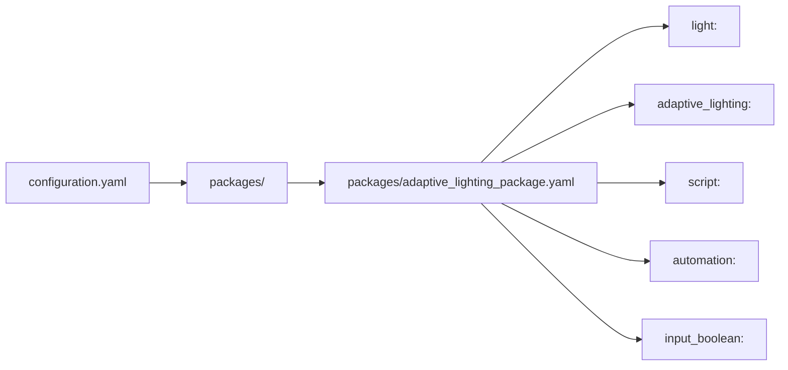
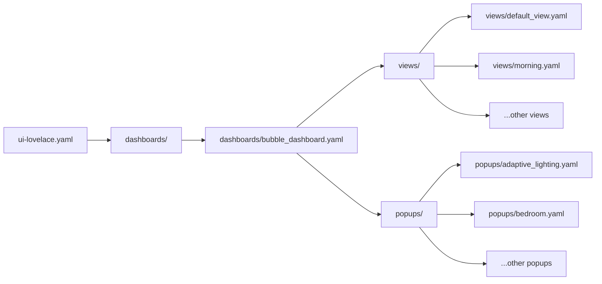

# Home Assistant Configuration Remediation Plan

This plan outlines issues found in the current Home Assistant configuration, focusing on the `packages` and `dashboards` directories, and proposes a refactored structure and configuration adhering to best practices for maintainability, scalability, and performance.

## 1. Package Structure and Duplication

**Issue:** Duplication of light group definitions.
**Problematic State:** Light groups for Adaptive Lighting are defined in both `packages/adaptive_lighting_package.yaml` and `packages/lights/adaptive_lighting.yaml`. This leads to redundancy and potential confusion.
**Target State:** Consolidate all Adaptive Lighting related configurations, including light groups, into the single feature-based package file (`packages/adaptive_lighting_package.yaml`). Remove the `packages/lights/adaptive_lighting.yaml` file.
**Justification:** Adhering to a feature-based package structure means all components related to a specific feature (like Adaptive Lighting) should reside within that feature's package file. This improves organization and prevents duplication.

**Remediation Example:**

*   **Remove:** The entire content of `packages/lights/adaptive_lighting.yaml`.
*   **Ensure:** The `light:` section in `packages/adaptive_lighting_package.yaml` contains all necessary light group definitions for Adaptive Lighting.

## 2. Adaptive Lighting Integration Configuration

**Issue:** Adaptive Lighting configuration is directly within the main package file.
**Problematic State:** While within the feature package, the Adaptive Lighting integration configuration itself is part of the larger package file, which can become lengthy.
**Target State:** Keep the Adaptive Lighting integration configuration within `packages/adaptive_lighting_package.yaml` as it aligns with the feature-based package approach. Ensure consistent naming and parameters across the different Adaptive Lighting instances.
**Justification:** This placement is appropriate for a feature-based package. The current configuration appears mostly correct, but consistency in naming and parameters is crucial for clarity.

**Remediation Example:**

*   Review each Adaptive Lighting instance (`- name: "..."`) in `packages/adaptive_lighting_package.yaml` to ensure consistent naming conventions and parameter usage. For example, ensure `interval`, `transition`, and `initial_transition` are set intentionally for each group.

## 3. Scripts and Automations

**Issue:** Complex template logic and potential for simplification in scripts and automations.
**Problematic State:** The `apply_adaptive_lighting_to_area` script contains complex and noted as "brittle" template logic for identifying the correct Adaptive Lighting switch based on area lights. Automations for updating manual control booleans are repetitive.
**Target State:** Refactor the `apply_adaptive_lighting_to_area` script to use a more robust method for identifying the Adaptive Lighting switch, potentially leveraging areas or device/entity registries if applicable, or simplifying the logic if possible. Consolidate repetitive automations using templates or by re-evaluating the need for individual manual control booleans if the Adaptive Lighting integration's built-in `manual_control` attribute is sufficient.
**Justification:** Simplifying template logic makes the configuration easier to understand and maintain. Reducing repetitive automations improves efficiency and reduces the likelihood of errors. Leveraging built-in integration features is generally preferred over custom workarounds.

**Remediation Example:**

*   **Refactor Script:** Revisit the logic in the `apply_adaptive_lighting_to_area` script (lines 137-177 in `packages/adaptive_lighting_package.yaml`) to find a more reliable way to map lights to their respective Adaptive Lighting switches. Consider using Home Assistant's area management features or entity attributes if available.
*   **Consolidate Automations:** Examine the automations for updating manual control booleans (lines 273-378). If the `manual_control` attribute of the Adaptive Lighting switches provides the necessary information, the input booleans and these automations might be redundant. If they are used for other logic, retain them but ensure their updates are handled efficiently (as per the automation consolidation).

## 4. Input Booleans

**Issue:** Input booleans for manual control status might be redundant.
**Problematic State:** Input booleans like `input_boolean.al_manual_control_non_hue` are used, seemingly to track the `manual_control` attribute of the Adaptive Lighting switches.
**Target State:** Rely on the built-in `manual_control` attribute of the Adaptive Lighting switches directly in the dashboard and automations where possible. Remove the input booleans and associated update automations if they are not serving a purpose beyond mirroring the attribute. If they are used for other logic, retain them but ensure their updates are handled efficiently (as per the automation consolidation).
**Justification:** Avoiding redundant entities simplifies the configuration and reduces overhead.

**Remediation Example:**

*   **Audit Usage:** Check where the `input_boolean.al_manual_control_*` entities are used (e.g., in dashboards, other automations).
*   **Remove if Redundant:** If their only purpose is to reflect the Adaptive Lighting switch's `manual_control` attribute, remove them from `packages/adaptive_lighting_package.yaml` and delete the corresponding update automations. Update dashboard cards to directly use the `attribute` of the Adaptive Lighting switch entity.

## 5. Dashboard Files Audit

**Issue:** Multiple dashboard files with overlapping content and inconsistent approaches.
**Problematic State:** There are three main dashboard files (`adaptive_living.yaml`, `bubble_dashboard.yaml`, `root.yaml`) and a `popups` directory with several popup configurations. There's a mix of using `streamline-card`, `bubble-card`, `include-template`, and inline card configurations. This makes the dashboard structure difficult to follow and maintain.
**Target State:** Consolidate the dashboard into a single primary dashboard file (`bubble_dashboard.yaml`). Establish a consistent approach for using custom cards and templates. Organize popups and views logically within the `dashboards` directory. Reduce complex inline styling and template logic within the dashboard files by leveraging themes, card options, or dedicated template files where appropriate.
**Justification:** A single, well-structured dashboard file with a consistent approach to includes and templates is significantly easier to manage and scale. Reducing inline complexity improves readability and performance.

**Remediation Examples:**

*   **Consolidate Dashboards:** Determine the intended purpose of each main dashboard file. If they are variations of the same dashboard, consolidate them into `bubble_dashboard.yaml` using features like `state-switch` or conditional cards to manage different views or contexts. If they are intended as completely separate dashboards, ensure their configurations are distinct and well-organized.
*   **Standardize Card Usage:** Choose a consistent method for using `bubble-card` and `streamline-card`. Leverage the template features of these cards or Home Assistant's `!include` and `!include_dir_contents` for reusable configurations.
*   **Refactor Inline Styling:** Move complex inline `styles:` blocks into themes or dedicated card template files if possible to improve readability and reusability.
*   **Review Popup Usage:** Ensure popups are called consistently (e.g., using `browser_mod.popup` or the built-in `more-info` action) and that their content is well-defined in the `popups` directory.

## 6. Templating in Dashboards

**Issue:** Complex Jinja2 templates within dashboard card configurations.
**Problematic State:** Some dashboard cards contain complex inline Jinja2 templates for displaying state or applying styles (e.g., in `dashboards/bubble_dashboard.yaml` and `dashboards/popups/bedroom.yaml`).
**Target State:** Simplify inline templates where possible. For complex logic, consider creating template sensors or using the `template` feature of custom cards if it supports more readable multi-line templates.
**Justification:** Moving complex logic out of the dashboard YAML improves readability and separates concerns.

**Remediation Example:**

*   **Simplify Templates:** Review templates within `state_display` or `styles` for opportunities to simplify the logic or move it to a template sensor if the calculated value is needed elsewhere.

## Proposed Package Structure (Feature-Based)

This diagram illustrates the proposed structure where the `adaptive_lighting_package.yaml` file contains all configurations related to the Adaptive Lighting feature.

## Proposed Dashboard Structure

This diagram shows a single main dashboard file (`bubble_dashboard.yaml`) that includes different views and popups organized in subdirectories.